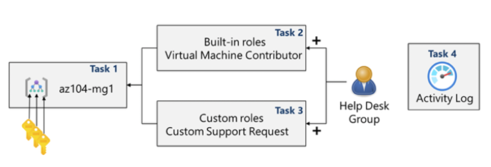

# Lab 02a – Manage Subscriptions and RBAC

## Goal
Improve access management at scale by organizing subscriptions with management groups and implementing least-privilege RBAC for a support team.

## Architecture

## What I did
- **Task 1:** Implemented **Management Groups** to logically organize subscriptions.
- **Task 2:** Reviewed and assigned a **built-in role** (e.g., Virtual Machine Contributor) for VM management.
- **Task 3:** Created a **custom RBAC role** (JSON definition) to allow only required permissions (e.g., create support requests) while excluding unnecessary actions (such as adding resource providers).
- **Task 4:** Monitored role assignments and changes using the **Activity Log**.

## Key concepts practiced
- Management Group hierarchy and scopes
- Built-in roles vs custom roles (least privilege)
- Custom role definition structure: Actions / NotActions / AssignableScopes
- Auditing RBAC changes via Activity Log

## Outcome
Centralized subscription governance via management groups and implemented auditable, least-privilege access for a Help Desk group.
