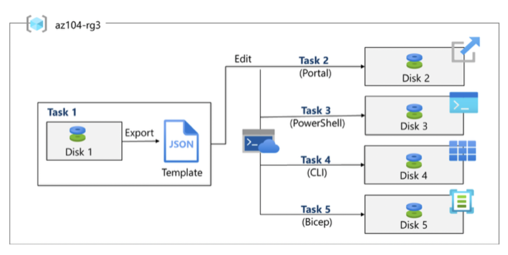

# Lab 03 – Manage Azure resources using ARM Templates & Bicep

## Goal
Automate and standardize Azure resource deployments using Infrastructure as Code (IaC) to reduce manual effort and human error.

## Architecture

## What I did
- **Task 1:** Created an **ARM template** by exporting an Azure resource as JSON.
- **Task 2:** Edited the ARM template and redeployed it via the Azure portal.
- **Task 3:** Configured Cloud Shell and deployed the template using **Azure PowerShell**.
- **Task 4:** Deployed the template using the **Azure CLI**.
- **Task 5:** Deployed a resource using **Azure Bicep** (declarative alternative to ARM JSON).

## Key concepts practiced
- Declarative deployments with ARM templates (JSON)
- Parameter files vs inline values (concept)
- Multiple deployment methods (Portal / PowerShell / CLI)
- Bicep as a concise, type-safe authoring experience (compiles to ARM)

## Outcome
Demonstrated repeatable deployments using ARM templates and Bicep across different deployment tools (portal, PowerShell, CLI).

## Templates (portfolio-ready)
- [ARM & Bicep templates (clean versions)](../templates/lab03-arm-bicep-managed-disk/)
