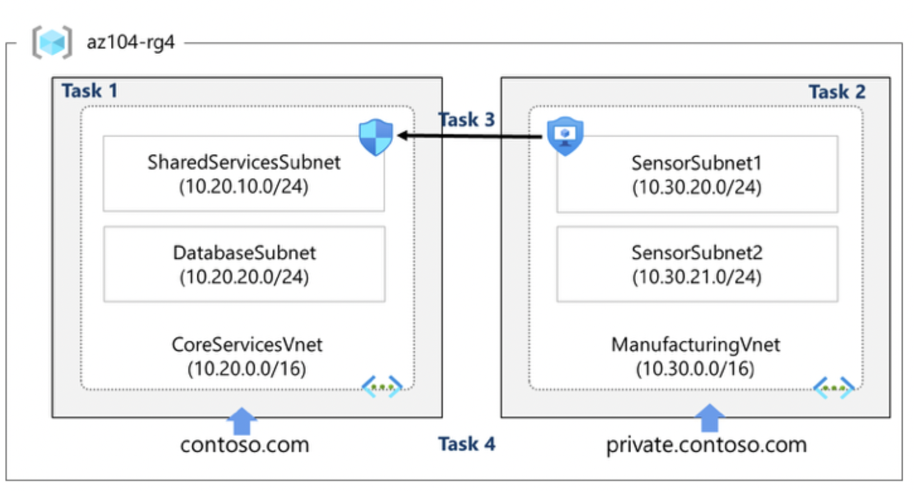

# Lab 04 – Implement Virtual Networking

## Goal
Build a scalable Azure networking foundation with non-overlapping address spaces, subnet segmentation, security controls, and DNS name resolution.

## Architecture

## What I did
- **Task 1:** Created **CoreServicesVnet** with subnets using the Azure portal (address planning for growth).
- **Task 2:** Deployed **ManufacturingVnet** using an ARM template by updating the template (replace occurrences of `CoreServicesVnet` → `ManufacturingVnet`) and redeploying.
- **Task 3:** Configured secure communication using **Application Security Groups (ASG)** with **Network Security Group (NSG)** rules.
- **Task 4:** Configured **Azure DNS**:
  - Public DNS zone for public name resolution
  - Private DNS zone linked to VNets for internal name resolution

## Key concepts practiced
- VNet and subnet design with non-overlapping CIDR ranges
- NSG inbound/outbound rule concepts
- ASG for grouping workloads by role (without hardcoding IPs)
- Public vs private DNS zones and VNet links

## Outcome
Demonstrated portal-based and template-based VNet creation with segmented subnets, security controls (NSG/ASG) and consistent name resolution using Azure DNS.
