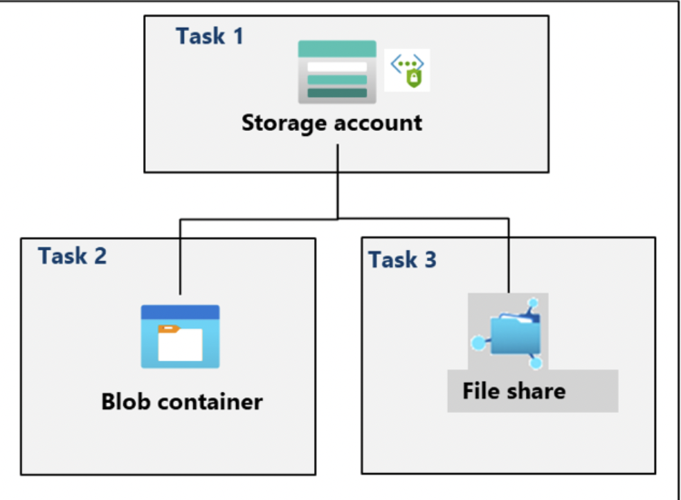

# Lab 07 – Manage Azure Storage

## Goal
Explore Azure Storage options for blob and file storage, focusing on secure configuration and protection options (redundancy, access, and governance).

## Architecture

## What I did
- **Task 1:** Created and configured a **Storage Account** (baseline settings).
- **Task 2:** Created and configured **secure Blob storage** (container configuration and access/security settings).
- **Task 3:** Created and configured **secure Azure Files** storage (file share configuration using Storage tools).

## Key concepts practiced
- Storage account as the namespace boundary for blobs/files/queues/tables
- Blob storage for unstructured data; Azure Files for shared folder-based storage
- Security levers (concept): secure transport, authentication/authorization, network access
- Redundancy models (concept): LRS / ZRS / GRS (and variants)

## Outcome
A secured Storage Account with a blob container and an Azure Files share, demonstrating storage configuration and protection options.
