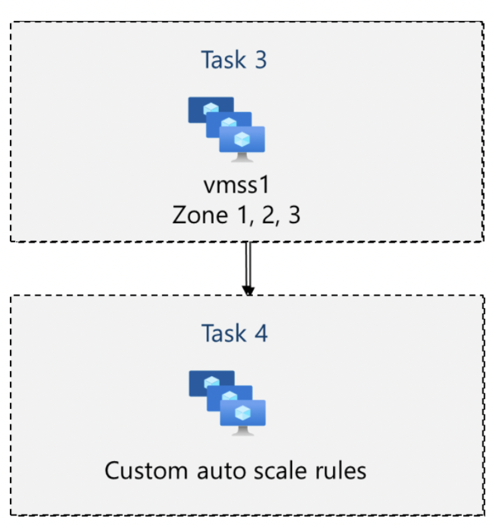

# Lab 08 – Manage Virtual Machines

## Goal
Compare single VM management (manual scaling) with Virtual Machine Scale Sets (automated horizontal scaling and autoscale).

## Architecture
### Zone-resilient VMs

### VM Scale Sets (VMSS) + autoscale

## What I did
- **Task 1:** Deployed **zone-resilient VMs** in different Availability Zones via Azure portal.
- **Task 2:** Managed VM scaling and updates (resize + compute/storage adjustments).
- **Task 3:** Created and configured a **Virtual Machine Scale Set (VMSS)** across zones.
- **Task 4:** Implemented **custom autoscale rules** for VMSS (scale out/in).
- **Task 5:** Created a VM using **Azure PowerShell**, then validated deployment and access.
- **Task 6:** Created a VM using **Azure CLI**, then validated deployment and access.

## Key concepts practiced
- Vertical scaling (resize) vs horizontal scaling (VMSS)
- Availability Zones for resiliency
- VMSS uniform configuration and autoscaling

## Outcome
Demonstrated both portal-based and command-line provisioning, plus vertical/horizontal scaling patterns (single VM vs VMSS autoscale).
