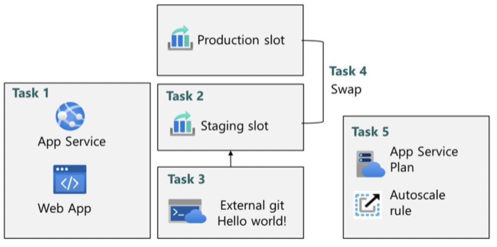

# Lab 09a – Implement Web Apps (Azure App Service)

## Goal
Host a website on Azure PaaS and enable safe deployments and scalable capacity.

## Architecture

## What I did
- **Task 1:** Created and configured an **Azure Web App** (App Service).
- **Task 2:** Created a **staging deployment slot**.
- **Task 3:** Configured continuous deployment in the staging slot using **Deployment Center → Settings** with **External Git** (repo + branch) and verified the “Hello World” app via the slot’s default domain.
- **Task 4:** Performed a **slot swap** (staging → production) to release changes safely.
- **Task 5:** Configured and tested **autoscaling** on the App Service Plan.

## Key concepts practiced
- PaaS hosting with App Service (runtime stacks incl. PHP)
- Deployment slots for isolated environments (staging vs production)
- Safe releases via slot swap
- Scaling via App Service Plan scale out + autoscale

## Outcome
A web app deployed from an external Git repo with a staging slot and controlled releases to production, plus autoscaling for demand.
