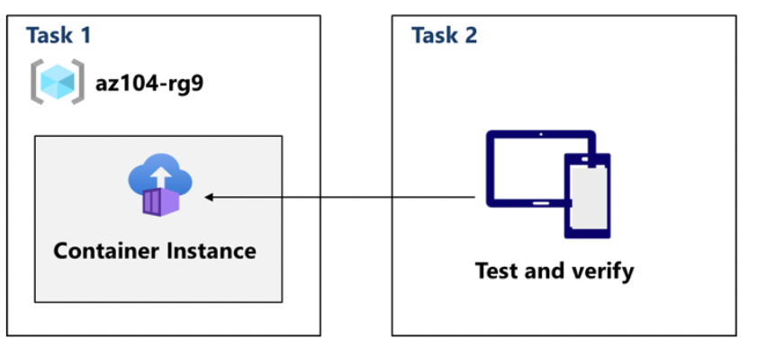

# Lab 09b – Implement Azure Container Instances (ACI)

## Goal
Evaluate a serverless container approach to run containerized workloads on Azure without managing VMs.

## Architecture

## What I did
- **Task 1:** Deployed an **Azure Container Instance** using a sample Docker image (“hello-world”).
- **Task 2:** Tested and verified the container deployment (checked container state/logs and validated availability where applicable).

## Key concepts practiced
- ACI as a serverless container runtime (no VM management)
- Suitable for quick runs, short-lived jobs and simple container workloads (concept)

## Outcome
Successfully deployed and validated a container workload on Azure using Azure Container Instances.
