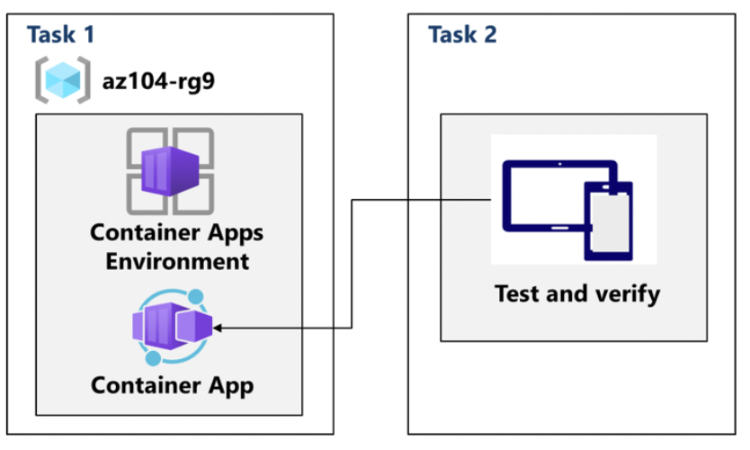

# Lab 09c – Implement Azure Container Apps (ACA)

## Goal
Evaluate Azure Container Apps as a serverless platform for running long-running containerized applications with managed orchestration.

## Architecture

## What I did
- **Task 1:** Created a **Container Apps Environment** and deployed an **Azure Container App** from a container image.
- **Task 2:** Tested and verified the deployment (app reachable and running).

## Key concepts practiced
- ACA as a serverless container platform with managed orchestration
- Environment as a boundary for configuration, networking and observability (concept)
- Suitable for long-running web workloads and scalable services (concept)

## Outcome
Successfully deployed and validated a containerized application on Azure Container Apps.
