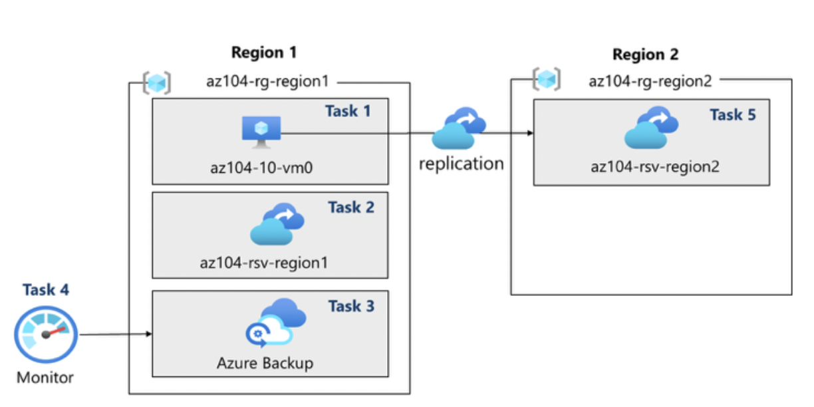

# Lab 10 – Implement Data Protection (Azure Backup + ASR)

## Goal
Protect Azure VMs against accidental or malicious data loss using Azure Backup and evaluate disaster recovery via cross-region replication with Azure Site Recovery.

## Architecture

## What I did
- **Task 1:** Provisioned base infrastructure using a template.
- **Task 2:** Created and configured a **Recovery Services Vault**.
- **Task 3:** Enabled **Azure VM backup** using a backup policy (schedule + retention).
- **Task 4:** Monitored **Azure Backup** jobs and health.
- **Task 5:** Enabled **Azure Site Recovery** replication for a VM from **East US → West US** using a secondary Recovery Services Vault.

## Key concepts practiced
- Recovery Services Vault as a management boundary for backup/DR
- Backup policies (frequency + retention)
- Monitoring backup jobs and health
- Disaster recovery via replication (ASR) to a secondary region

## Outcome
A VM protected with scheduled backups and monitored operations, plus cross-region replication readiness for DR scenarios.
