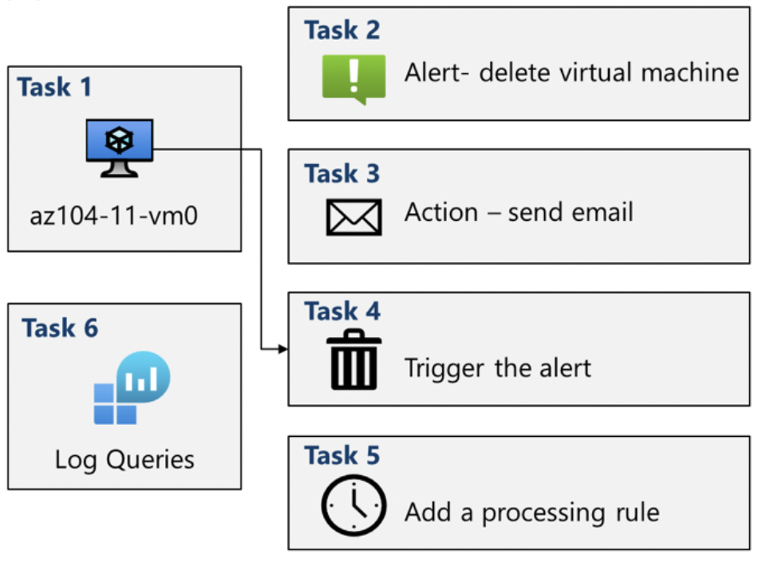

# Lab 11 – Implement Monitoring (Azure Monitor)

## Goal
Detect and notify on significant infrastructure changes using Azure Monitor alerts, action groups, processing rules, and log queries.

## Architecture

## What I did
- **Task 1:** Provisioned baseline infrastructure using a template (test VM).
- **Task 2:** Created an **Azure Monitor alert rule** for VM-related conditions/events.
- **Task 3:** Configured an **Action Group** to send notifications (email).
- **Task 4:** Triggered the alert and verified end-to-end notification delivery.
- **Task 5:** Added an **alert processing rule** to manage alert handling/noise.
- **Task 6:** Used **Azure Monitor log queries (KQL)** for investigation and reporting.

## Key concepts practiced
- Alert rules and signals (metrics/logs/activity)
- Action groups for notifications
- Alert processing rules (suppression/routing concepts)
- Log Analytics queries (KQL basics)

## Outcome
A functioning monitoring and alerting pipeline with notifications and follow-up investigation using log queries.
